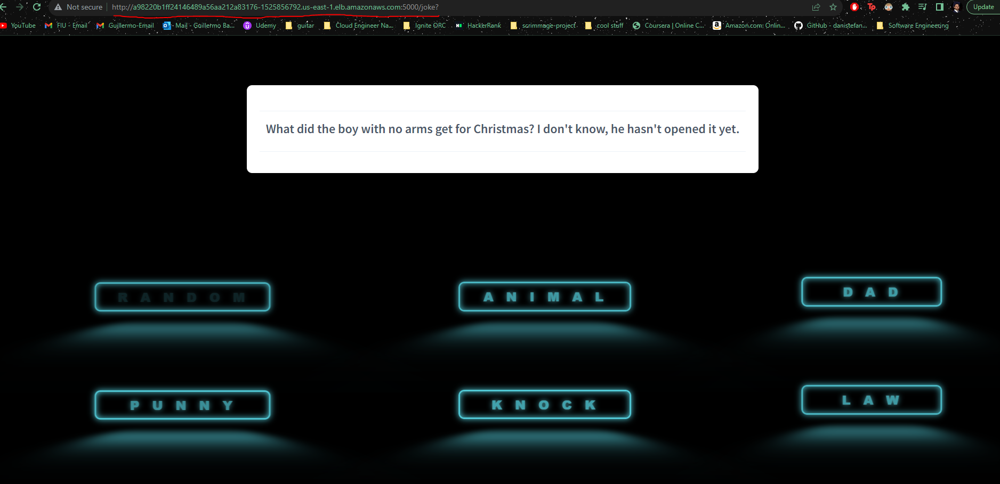
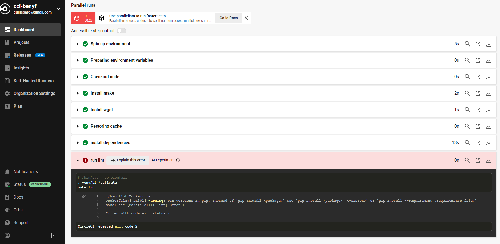

# Udacity-Cloud-Engineering-Capstone
Udacity Cloud DevOps Engineering:  Nano-degree Capstone Project

This project is the application of learned content in the Cloud DevOps Engineering: Nano-degree Course.

## Application: Joke App Deployment
This repo takes a simple joke displaying python flask application and deploys it to AWS EKS while creating/configuring cloud infrastructure. The project is deployed using helm charts via ansible through the circl-ci pipeline tool.

Application URL: http://a98220b1ff24146489a56aa212a83176-1525856792.us-east-1.elb.amazonaws.com:5000
### Deployed Web App

### Linting
Lint checks using pylint and hadolint are performed (as recommended from project 4)

#### Failed

#### Succeeded

## Infrastructure
Useful code from previous projects is reused and modified to promote reusability of modular code. 
The project is run using the circle-ci ci/cd tool. It is deployed within it's own configured network that utilizes EKS (Elastic Kubernetes Service) orchestration tool. The config.yml builds the application, creates a docker then tags and pushes it to dockerhub, creates networking infrastructure, kubernetes cluster and a manager instance all via cloudformation. Upon completing the infrastructure the application creates an EC2 management instance to interface with the kubernetes cluster. The manager system is then configured with multiple dependencies. The manager system is then utilized to deploy the python web app via helm charts. Once deployed, the public DNS name is returned and the application is accessible to the public.

#### Utlized Course Knowledge
- Kubernetes
- CI/CD (Circle-CI)
- Cloudformation, Ansible, and Shell Scripting
- Helm (Bonus)
- Docker
- AWS
- Cloud Architecture

### Circle CI Pipeline

### AWS Cloudformation Stacks

### Kubernetes Service and Pods

### Docker Registry

